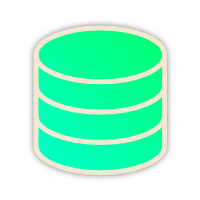

<div align="center">


# MongoFramework
An "Entity Framework"-like interface for MongoDB


[](https://codecov.io/gh/TurnerSoftware/MongoFramework)
[](https://www.nuget.org/packages/MongoFramework/)
[](https://www.codacy.com/app/Turnerj/MongoFramework)
</div>

## Overview
MongoFramework tries to bring some of the nice features from Entity Framework into the world of MongoDB.

Some of the major features include:
- Entity mapping for collections, IDs and properties through attributes
- Indexing through attributes (including text and geospatial)
- Fluent mapping builder
- Entity change tracking
- Changeset support (allowing for queuing multiple DB updates to run at once)
- Diff-updates (only _changes_ to an entity to be written)
- Entity Buckets (clustering of small documents together, [improving index performance](https://www.mongodb.com/blog/post/building-with-patterns-the-bucket-pattern))
- Runtime type discovery (serialize and deserialize without needing to specify every "known" type)

MongoFramework is currently built on-top of the official MongoDB C# driver.

## Licensing and Support

MongoFramework is licensed under the MIT license. It is free to use in personal and commercial projects.

There are [support plans](https://turnersoftware.com.au/support-plans) available that cover all active [Turner Software OSS projects](https://github.com/TurnerSoftware).
Support plans provide private email support, expert usage advice for our projects, priority bug fixes and more.
These support plans help fund our OSS commitments to provide better software for everyone.

## MongoFramework Extensions
These extensions are official packages that enhance the functionality of MongoFramework, integrating it with other systems and tools.

### MongoFramework.Profiling.MiniProfiler
[](https://www.nuget.org/packages/MongoFramework.Profiling.MiniProfiler/)
[](https://www.nuget.org/packages/MongoFramework.Profiling.MiniProfiler/)

Supports profiling database reads and writes, pushing the data into [MiniProfiler](https://github.com/MiniProfiler/dotnet/).

## Documentation

### Entity Mapping Basics
The core mapping of entities and their properties is automatic however you have the choice of using the fluent mapping builder or certain attributes to alter this behaviour.

**Fluent Mapping**
```csharp
using MongoFramework;

public class MyEntity
{
  public string Id { get; set; }
  public string Name { get; set; }
  public string Description { get; set; }
}

public class MyContext : MongoDbContext
{
  public MyContext(IMongoDbConnection connection) : base(connection) { }
  public MongoDbSet<MyEntity> MyEntities { get; set; }

  protected override void OnConfigureMapping(MappingBuilder mappingBuilder)
  {
    mappingBuilder.Entity<MyEntity>()
      .HasProperty(m => m.Name, b => b.HasElementName("MappedName"))
      .ToCollection("MyCustomEntities");
  }
}
```

**Attribute Mapping**
```csharp
using MongoFramework;
using System.ComponentModel.DataAnnotations;

[Table("MyCustomEntities")]
public class MyEntity
{
  public string Id { get; set; }
  [Column("MappedName")]
  public string Name { get; set; }
  public string Description { get; set; }
}

public class MyContext : MongoDbContext
{
  public MyContext(IMongoDbConnection connection) : base(connection) { }
  public MongoDbSet<MyEntity> MyEntities { get; set; }
}
```

For attribute mapping, many of the core attributes are part of the `System.ComponentModel.Annotations` package.

|Attribute|Description|
|---------|-----------|
|`[Table("MyFancyEntity", Schema = "MyNamespace")]`|Map the Entity to the collection specified. When a schema is specified, it is prefixed onto the name with a "." (dot) separator.|
|`[Key]`|Map the property as the "Id" for the entity. Only required if your key doesn't have a common name like "Id" etc.|
|`[NotMapped]`|When applied to a class or property, skips mapping when reading/writing.|
|`[Column("NewColumnName")]`|Remaps the property with the specified name when reading/writing.|

### Indexing
MongoFramework supports indexing specified through both the fluent mapping builder and the `IndexAttribute`.
This is applied to the properties you want indexed and will apply the changes to the database when the context is saved.

**Fluent Mapping**
```csharp
mappingBuilder.Entity<IndexExample>()
  .HasIndex(e => e.EmailAddress, b => b.HasName("Email").IsDescending(false));
```

**Attribute Mapping**
```csharp
public class IndexExample
{
  public string Id { get; set; }

  [Index("Email", IndexSortOrder.Ascending)]
  public string EmailAddress { get; set; }

  public string Name { get; set; }
}
```


The following variations of indexes are supported across various property types:
- [Single field](https://docs.mongodb.com/manual/core/index-single/)
- [Compound](https://docs.mongodb.com/manual/core/index-compound/#compound-indexes)
- [Multikey indexes](https://docs.mongodb.com/manual/core/index-multikey/)

To support compound indexes, define indexes with the same name across multiple properties.
When doing this, you will want to control the order of the individual items in the compound index which is available through the `IndexPriority` property on the attribute. 

For fluent mapping, you can specify multiple indexes in one declaration to combine them and handle nesting for complex data structures including through arrays.

```csharp
public class TestModelBase
{
  public string Id { get; set; }
  public string Name { get; set; }
  public IEnumerable<NestedModel> ManyOfThem { get; set; }
}

public class TestModel : TestModelBase
{
  public Dictionary<string, object> ExtraElements { get; set; }
  public string OtherName { get; set; }
  public int SomethingIndexable { get; set; }
  public NestedModelBase OneOfThem { get; set; }
}

public class NestedModelBase
{
  public string Description { get; set; }
}

mappingBuilder.Entity<TestModel>()
  .HasIndex(m => new
  {
    m.SomethingIndexable,
    m.OneOfThem.Description,
    m.ManyOfThem.First().AnotherThingIndexable
  }, b => {
    b.HasName("MyIndex")
      .IsDescending(true, false, false)
  });
```

#### Special Index Types
MongoFramework supports [Text](https://docs.mongodb.com/manual/core/index-text/) and [2dSphere](https://docs.mongodb.com/manual/core/2dsphere/) special indexes.
For attribute mapping, these special index types are selected through the `IndexType` property on the `IndexAttribute`.

Please consult MongoDB's documentation on when the indexes are appropriate and their restrictions.

### Contexts and Connections
Like Entity Framework, MongoFramework is built around contexts - specifically the `MongoDbContext`.
An example context would look like:

```csharp
public class MyContext : MongoDbContext
{
  public MyContext(IMongoDbConnection connection) : base(connection) { }
  public MongoDbSet<MyEntity> MyEntities { get; set; }
  public MongoDbSet<MyOtherEntity> MyOtherEntities { get; set; }
}
```

While it mostly feels the same as creating contexts in Entity Framework, there are a number of differences still with the biggest being in the creation of contexts.
The `IMongoDbConnection` is the core infrastructure that allows connection to MongoDB and is required to instantiate a context.

You can create an instance of a connection in two ways:
```csharp
IMongoDbConnection connection;

//FromUrl
connection = MongoDbConnection.FromUrl(new MongoUrl("mongodb://localhost:27017/MyDatabase")); //MongoUrl comes from the official MongoDB driver

//FromConnectionString
connection = MongoDbConnection.FromConnectionString("mongodb://localhost:27017/MyDatabase");
```

### Special Queries
You can perform text queries (with a Text index), geospatial distance queries (with a 2dSphere index) and geospatial intersecting queries.

```csharp
myContext.MyDbSet.SearchText("text to search");
myContext.MyDbSet.SearchGeoIntersecting(e => e.FieldWithCoordinates, yourGeoJsonPolygon);
myContext.MyDbSet.SearchGeoNear(e => e.FieldWithCoordinates, yourGeoJsonPoint);
```

Each of these returns an `IQueryable` which you can continue to narrow down the results like you would normally with LINQ.
For `SearchGeoNear` specifically, there are optional parameters for setting the distance result field, the minimum distance and the maximum distance.

### Entity Buckets
Entity buckets are a method of storing many smaller documents in fewer larger documents. MongoFramework provides various classes that help in creating and managing buckets.
A typical setup for using an entity bucket might look like:

```csharp
public class MyBucketGrouping
{
  public string SensorId { get; set; }
  public DateTime Date { get; set; }
}

public class MyBucketItem
{
  public DateTime EntryTime { get; set; }
  public int Value { get; set; }
}

public class MyContext : MongoDbContext
{
  public MyContext(IMongoDbConnection connection) : base(connection) { }
  [BucketSetOptions(bucketSize: 1000, entityTimeProperty: nameof(MyBucketItem.EntryTime))]
  public MongoDbBucketSet<MyBucketGrouping, MyBucketItem> MyBuckets { get; set; }
}
```

The attribute `BucketSetOptions` is required. 
The `bucketSize` is the maximum number of items in a single bucket.
The `entityTimeProperty` identifies the property name in the sub-entity where a timestamp is stored.

Keep in mind the limitations of MongoDB (size of document) when determining the number of items in a bucket.

Managing buckets is very similar to managing normal entities though are currently limited to add data only.

```csharp
using (var context = new MyContext(MongoDbConnection.FromConnectionString("mongodb://localhost:27017/MyDatabase")))
{
  context.MyBuckets.AddRange(new MyBucketGrouping
  {
    SensorId = "ABC123",
    Date = DateTime.Parse("2020-04-04")
  }, new []
  {
    new MyBucketItem
    {
      EntryTime = DateTime.Parse("2020-04-04T01:00"),
      Amount = 123
    },
    new MyBucketItem
    {
      EntryTime = DateTime.Parse("2020-04-04T02:00"),
      Amount = 456
    },
    new MyBucketItem
    {
      EntryTime = DateTime.Parse("2020-04-04T03:00"),
      Amount = 789
    }
  });

  await context.SaveChangesAsync();
}
```

### Extra Elements
Sometimes your model in the database will have more fields than the model you are deserializing to. You have two options to control the behaviour: ignore the fields or accept, mapping the extra fields to a specific dictionary.

To ignore the fields, you need to specify the `IgnoreExtraElements` attribute on the entity's class definition.
To map the fields, you need to specify the `ExtraElements` attribute on an `IDictionary<string, object>` property.

### Runtime Type Discovery
MongoFramework provides runtime type discovery in two methods: automatically for any properties of type `object` and for any entities that specify the `RuntimeTypeDiscovery` attribute on their class definition.

This type discovery means that you don't need to know what potential types extend any others which you would otherwise need to set via the `BsonKnownTypes` attribute by the MongoDB driver.

```csharp
[RuntimeTypeDiscovery]
public class KnownBaseModel
{
}

public class UnknownChildModel : KnownBaseModel
{
}

public class UnknownGrandChildModel : UnknownChildModel
{
}
```

Without the `RuntimeTypeDiscovery` attribute in this scenario, the model will fail to deserialize properly from the database.

## Complete Example
```csharp
using MongoFramework;
using System.ComponentModel.DataAnnotations;

public class MyEntity
{
  public string Id { get; set; }
  public string Name { get; set; }
  public string Description { get; set; }
}

public class MyContext : MongoDbContext
{
  public MyContext(IMongoDbConnection connection) : base(connection) { }
  public MongoDbSet<MyEntity> MyEntities { get; set; }
}

...

var connection = MongoDbConnection.FromConnectionString("YOUR_CONNECTION_STRING");
using (var myContext = new MyContext(connection))
{
  var myEntity = myContext.MyEntities.Where(myEntity => myEntity.Name == "MongoFramework").FirstOrDefault();
  myEntity.Description = "An 'Entity Framework'-like interface for MongoDB";
  await myContext.SaveChangesAsync();
}

```
